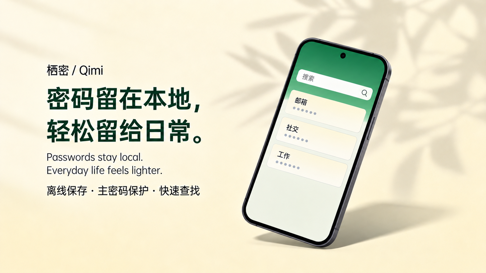

# 栖密 · Qimi

**简体中文** · [English](README.en.md)

[项目主页](https://chenzhiyong1994.github.io/qimi/) · [GitHub](https://github.com/chenzhiyong1994/qimi) · [问题反馈](https://github.com/chenzhiyong1994/qimi/issues)

**密码留在本地，轻松留给日常。**



栖密是一款面向 Android 的开源本地密码管理应用，用主密码保护账号资料，让记录、查找和手动取用更顺手。应用不申请 `INTERNET` 权限，不接入云账户、云同步、联网埋点或远程图标。

当前为 **S1 开发版本**，源码开放供学习、审阅与参与开发。尚未完成完整安全审查、备份恢复和系统云备份 / 设备迁移实测，请只使用合成资料测试，勿用于保管真实密码。Release 构建尚未正式签名，没有正式分发 APK；已实现、已验证和待完成的范围见[项目状态](docs/project-status.md)与[验证记录](docs/validation-s1.md)。

## 当前能力

- 创建本地加密密码库，以主密码解锁。
- 保存名称、账号、密码、网址与备注，保留账号和密码原值。
- 搜索记录，查看详情，按需显示或复制密码。
- 主动锁定与后台锁定，密码定时隐藏和敏感剪贴板清理。
- 森林绿 / 暖白界面、深色主题与原生 Compose 交互；独立品牌标记和自适应应用图标。

密码库使用 KDBX 4.1，保存过程包含候选复验、原子提交与失败回退。参数、数据保真和兼容边界见[密码库核心契约](vault-core/README.md)。外部 KDBX 互操作尚未验证。

## 后续路线

| 增量 | 计划内容 |
| --- | --- |
| S2 | 离线加密备份、可读性验证、恢复与失败保全 |
| S3 | 零散资料整理、其他登录方式、加密草稿与编辑 |
| S4 | 标签与收藏、密码生成、历史和回收站 |
| S5 | 生物识别解锁与可信目标的系统自动填充 |
| S6 | 完整 MVP、兼容与安全验收、发布准备 |

这些能力尚未实现，优先推进 S2。完整依赖和验收边界见[迭代路线](docs/iteration-roadmap.md)。

## 构建与验证

准备 **JDK 17**、**Android SDK Platform 36** 和 **Build Tools 35.0.0**，配置 `JAVA_HOME` 与 `ANDROID_HOME`。项目自带 **Gradle 8.14.5** Wrapper，不需要全局安装 Gradle。首次构建需要下载声明的工具与依赖；APP 本身没有联网功能。最低配置为 Android 10（API 29），实际设备支持范围仍在验证。

Windows / PowerShell 7，在项目根目录运行：

```powershell
pwsh -NoProfile -File scripts/android.ps1
pwsh -NoProfile -File scripts/check-package.ps1
pwsh -NoProfile -File scripts/check-docs.ps1
```

Linux / macOS，在配置好同样的 JDK 与 SDK 后运行 Gradle Wrapper：

```bash
./gradlew :vault-core:test :app:testDebugUnitTest :app:lintDebug \
  :app:assembleDebug :app:assembleRelease :app:assembleDebugAndroidTest \
  --no-daemon --console=plain
```

Debug APK 输出至 `app/build/outputs/apk/debug/app-debug.apk`；未签名 Release 输出至 `app/build/outputs/apk/release/app-release-unsigned.apk`。版本、依赖校验、重建和设备测试步骤见[开发文档](docs/development.md)。设备测试会重建合成夹具，只可在专用合成测试模拟器上执行。

Debug 的标准 Android Emulator 解锁页提供“一键解锁测试库”，仅适用于已有合成夹具口令的密码库。它仍经过正常认证，不创建或覆盖密码库；Release 不包含该按钮或合成口令。

## 参与开发

欢迎通过 [Issues](https://github.com/chenzhiyong1994/qimi/issues) 提交可复现问题和通过 [Pull Requests](https://github.com/chenzhiyong1994/qimi/pulls) 改进实现、测试或文档。请使用合成资料，不上传真实密码库、密码、密钥或未脱敏日志。涉及密码库、恢复和自动填充的改动须保留现有安全边界，并提供对应验证证据。

维护与阅读入口：

- [项目状态](docs/project-status.md)、[项目约束](AGENTS.md)：当前事实与维护约定。
- [产品方案](docs/product-plan.md)、[体验规格](docs/experience-spec.md)：目标、范围与用户路径。
- [安全与数据规格](docs/security-and-data.md)、[验收场景](docs/acceptance.md)：数据边界与验证要求。
- [开发文档](docs/development.md)、[核心模块](vault-core/README.md)、[决策记录](docs/decisions.md)：重建、存储契约与技术选择。
- [品牌资产](assets/brand/README.md)：Logo 矢量、透明 PNG 与导出方式。

## 许可证

自有源码与成品品牌资产采用 [Apache-2.0](LICENSE)。第三方许可和归属见 [THIRD_PARTY_NOTICES.md](THIRD_PARTY_NOTICES.md) 与 [NOTICE](NOTICE)。
