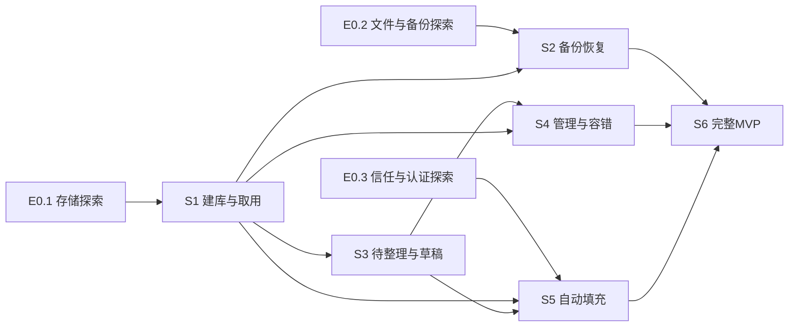

# Android 首版迭代路线

本路线把 [产品方案](product-plan.md) F01–F08 拆成可独立验证的任务。Android 工程已建立，当前推进 E0.1 与 S1；实际产出和证据见[项目状态](project-status.md)。本路线不自动发起 Goal、聊天或开发任务。

定位实现细节时使用 [体验规格](experience-spec.md) P01–P14、UX-01–UX-23 与 [安全与数据规格](security-and-data.md) SEC-01–SEC-23；场景和需求映射以 [验收场景](acceptance.md) 为准。编号用于精确定位，新增规则继续追加，不因调整顺序重编号。

## 探索先于依赖它的实现

E0 是短范围工程探索，不能当作已可使用的产品增量。具体选型维护在 [决策记录](decisions.md)，不在此重复技术参数。

| 探索 | 结果 | 验证材料 | 阻塞的工作 |
| --- | --- | --- | --- |
| E0.1 存储与主密码 | 选定可以保真保存核心逻辑字段并支持跨设备恢复的成熟方案 | 合成数据读写、错误密码、篡改文件、原子写入/中断、字符保真、版本与许可证记录 | S1 核心密码库；D3、D7 |
| E0.2 本地文件与备份 | 找到满足本地约束的出口与恢复路径，区分系统云备份和 D2D | 本机/独立介质文件验证、未知提供方拒绝、云/D2D 测试方法与可用设备清单 | S2 正式备份与公开支持承诺；D2、D4 |
| E0.3 目标信任与认证 | 明确原生 APP、浏览器和未知 WebView 的离线处理能力 | 包名/签名与浏览器来源原型、生物识别认证绑定、失效回退、目标切换 | S5 自动填充与便利解锁；D2、D3、D4 |

探索可以用合成材料在独立任务中推进；共享工程、Schema、依赖和密钥接口必须有明确的一个负责人整合，不并行改写同一文件。事实足够即可记录选择并继续，不机械等待所有事项由用户批准。

## 交付增量

### S1 本地建库、记录与手动取用

- 结果：用户能创建密码库，保存一条结构化账号，重启并解锁后搜到和取用它。
- 范围：最小 Android 工程、主密码保护、加密持久化、短表单、搜索与详情、显示/复制、后台遮蔽与锁定。
- 依赖：E0.1 完成；无须先开发全部标签、历史或自动填充界面。
- 证据：离线创建与重开，错误主密码保持锁定，文件/日志无合成秘密明文，原值保真，实际保存结果与提示一致。
- 边界：只用合成测试资料，不宣传已经可保管真实密码；不接联网组件，不采用临时明文数据库等待后续替换。

2026-10-04 按用户新增请求，优先在 S1 表单接入基础密码生成：三档复杂度、互斥且选填的高级自定义、内存候选与明确使用。默认普通且高级关闭，详细规则见 UX-12，随机与生命周期边界见 SEC-23，验证见 AC-09。同日按后续请求加入已保存条目的五字段编辑，复用新增表单并按原 ID / 基准版本保存；列表简化为名称与固定密码遮罩，移除指定冗余说明。上述增量只依赖 S1，不引入草稿、生成器复制或随机口令，也不代表 S3 / S4 整体完成；具体实现与验证状态仍由[项目状态](project-status.md)记录。

### S2 加密备份、验证与恢复

- 结果：用户能把本地加密文件转存到独立介质，并在新环境恢复；失败时原库保留。
- 范围：内部快照、主动导出、本地文件来源、恢复预览、只验证、健康库替换、损坏库恢复、兼容与回退。
- 依赖：S1、E0.2；备份的数据和版本定义须使用已验证的存储接口。
- 证据：同机验证与另一受支持设备恢复；错误密码、篡改/损坏、空间不足与中断；故障副本保全；云备份和 D2D 独立检查。
- 边界：不增加自动合并或云位置；不能用“文件已生成”替代“已验证可恢复”；未完成前不引入真实使用。

### S3 零散资料与可恢复编辑

- 结果：用户可以先保存一段杂乱原文，逐条整理成不同账号，中途退出后恢复最近成功草稿。
- 范围：待整理、保守本地识别、手动字段确认、登录方式与提供方、加密草稿、版本冲突、多个账号与别名。
- 依赖：S1；与 S2 没有产品功能阻塞关系，但共享模型与持久化实现不可冲突修改。
- 证据：原文保全、多段摘录与单条转换、身份不自动合并、密码/账号保真、草稿与条目提交原子性、锁定和杀进程后的真实恢复边界。
- 边界：解析建议不能直接转为可信目标或正式密码；不调用云端 AI；不扩大到 CSV 或 OCR。

### S4 日常管理与容错

- 结果：用户能快速查找常用身份、生成并使用新密码、找回旧密码与误删记录。
- 范围：收藏、标签、最近使用、归档、密码生成与加密草稿 / 复制的后续衔接、有限历史、删除撤销、回收站与永久删除。基础编辑、候选生成与填入共享表单已拆到前述 S1 增量。
- 依赖：S1、S3 的草稿和条目状态能力。
- 证据：查找任务观察、生成器取消和应用区别、候选持久化后复制、历史恢复、归档禁止填充、回收站恢复原状态，危险操作与副本边界文案。
- 边界：不能静默覆盖、清空回收站或把逻辑删除宣传为所有介质擦除；不依赖在线图标。

### S5 生物识别与系统自动填充

- 结果：在明确支持的 APP/浏览器范围内，用户可认证、选中正确账号并完成登录字段填入。
- 范围：本机密钥绑定、强生物识别、失效回退、目标关联、包名/签名或可信 host 校验、请求级授权、多账号候选和复制回退。
- 依赖：S1、S3、E0.3；必须支持条目状态过滤。与 S2 的恢复后信任重建做集成验收。
- 证据：正常填充、相似域名、签名异常、未知 WebView、取消认证、目标变化、锁屏、无硬件/密钥失效，新设备及同机快照恢复不继承旧授权；覆盖 AC-10/11/17/21。
- 边界：不申请无障碍、悬浮窗来绕过目标验证；不自动点击登录；不承诺覆盖所有 APP。

### S6 完整 MVP 与发布准备

- 结果：F01–F08 的首版闭环可以交给小范围用户验证，并明确支持边界与数据保护方法。
- 范围：统一设置、离线帮助、备份引导、深色/字体/读屏、脱敏本地记录、兼容矩阵、性能与用户任务测试、更新和迁移说明。
- 依赖：S1–S5；未解决的外流、误填和数据丢失问题不能通过本阶段文案掩盖。
- 证据：[验收场景](acceptance.md)中适用项完成并附记录；明确未支持组合；实际构建与设备证据；安全实现审查与恢复演练。
- 边界：公开测试或发布需要对应用户授权；完成文档或构建成功不能标记正式发布完成。

## 依赖关系

按 2026-10-04 用户请求，先完成 S1 密码生成、基础编辑与界面精简增量，再继续 S2。S2 与 S3 的先后是保护真实使用的推荐顺序，不伪造为技术依赖。并行工作只能发生在没有阻塞且没有共享写入面的部分。

## 后续版本

完成首版的用户任务与恢复验证后，再评估 P1：CSV 导入、离线弱密码/重复密码检查、更好的本地整理、可选提醒。OCR 必须先验证全程本地和误识别处理。TOTP、桌面与跨设备合并、通行密钥属于 P2，另立实际需求与安全契约，不自动加入当前开发范围。

每个增量结束更新 [项目状态](project-status.md)，记录实际产出和证据；出现新的决定更新 [决策记录](decisions.md)。本路线不设虚构日期、人力或工期承诺。
