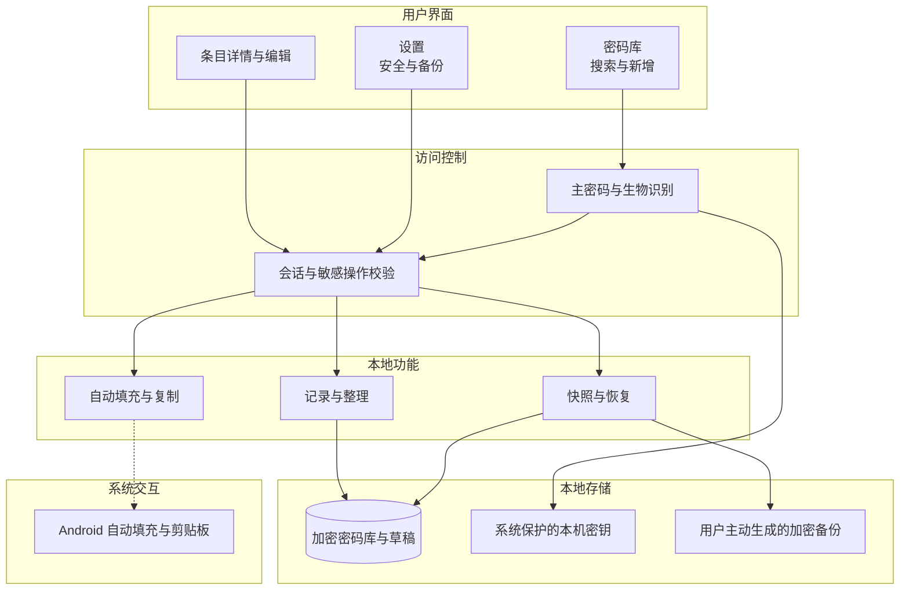
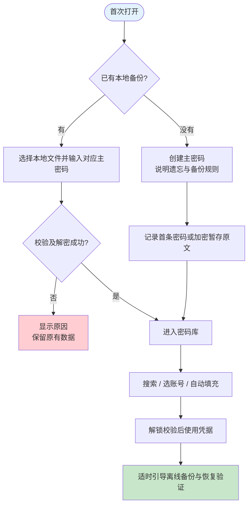
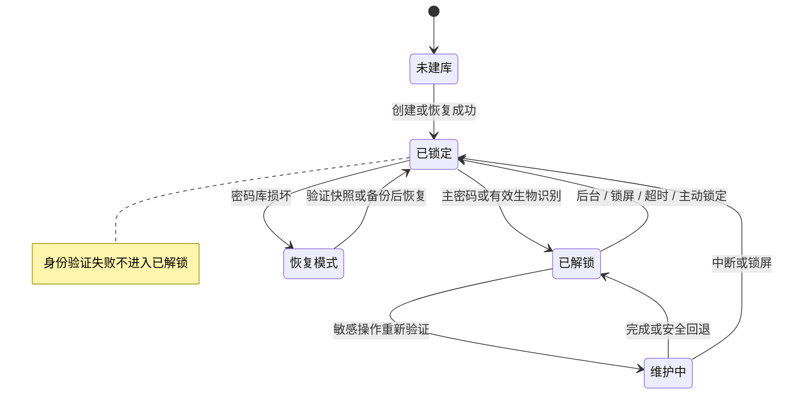
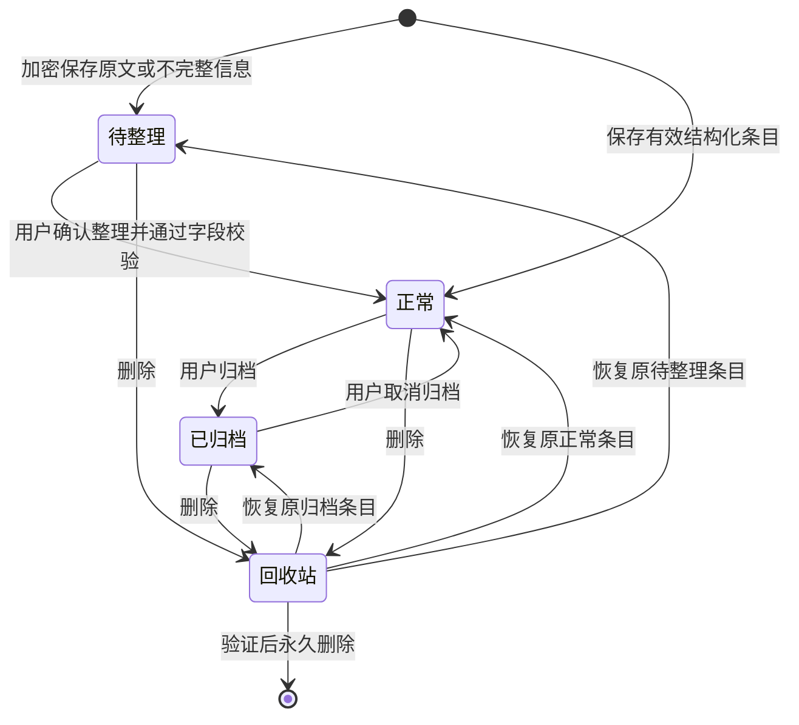

# 本地密码管理 Android APP 产品方案

建议将产品定位为面向普通个人用户的本地密码保险库：零散信息先安全记下，需要登录时快速找到并使用，误操作和换机时能够恢复。核心体验闭环是“记下来 → 找得到 → 用得上 → 可恢复”。首版优先 Android，数据仅存本地，不建立云端密码库。

本文是 0–1 产品方案 v0.2，覆盖首版范围、页面、数据与状态规则、安全边界、异常和验收，并作为独立项目的需求基线。方案中的功能、默认值和指标均为设计建议；平台能力以引用的官方文档为依据，实际兼容性和安全性需在实现后验证。Android 已开始按 S1 增量实现，实际完成范围与证据见[项目状态](project-status.md)，不把本方案全部功能视为已经交付。

详细页面与文案维护于 [体验规格](experience-spec.md)，信任边界与逻辑数据模型维护于 [安全与数据规格](security-and-data.md)，执行步骤维护于 [验收场景](acceptance.md)。[迭代路线](iteration-roadmap.md)安排后续增量，[决策记录](decisions.md)维护待决事项，[项目状态](project-status.md)记录实际进展。本文负责产品目标、功能范围和核心规则，其他文档补充细节，不另建一套需求。

| 文档信息 | 内容 |
| --- | --- |
| 版本与日期 | v0.2，2026-10-01 |
| 需求方 | 用户 |
| 编写 | Codex |
| 审核 | [TODO：指定产品、Android 与安全评审负责人] |
| 产品定型 | 个人工具型产品；商业模式待定；0–1 首版产品方案 |
| 已明确要求 | 管理各平台的零散密码；数据仅本地、不上云；Android 首发；兼顾顺畅体验与安全 |
| 设计假设 | 单人使用、单密码库；主要管理网站与 APP 的登录信息；不要求实时跨设备同步 |

## 修改记录

| 日期 | 变更 | 版本 |
| --- | --- | --- |
| 2026-10-01 | 建立 Android 首版方案，补充录入、使用、备份、安全与状态闭环 | v0.1 |
| 2026-10-01 | 建立独立项目，丰富目标用户、需求分级、体验与安全规格、验收场景和迭代维护入口 | v0.2 |
| 2026-10-01 | 选定当前品牌“栖密”与 slogan，统一品牌表达 | v0.2 |

## 1、项目背景

用户已明确存在“各个平台密码杂乱，需要集中记录”的需求，并要求数据留在本地。其余痛点需要通过真实用户访谈验证，不能据此推断已有用户数量或市场规模。

首版围绕以下设计假设展开：

| 待验证问题 | 对应设计 |
| --- | --- |
| 记录太繁琐，用户继续把密码散放在便签里 | 最小表单；零散文字加密暂存；整理可后置 |
| 只记住平台，忘记用哪个手机号或邮箱注册 | 一个登录身份一条记录；支持同平台多个账号与别名 |
| 每次登录都要切换 APP 找密码 | 系统自动填充；全局搜索；一键复制回退 |
| 担心本地数据泄露或丢失 | 整库加密、自动锁定、离线备份与恢复验证 |

## 2、需求基本情况与用户场景

首版只有密码库所有者一个用户角色，不引入管理员、企业协作或多租户。目标人群是假设中的普通个人用户；使用频率、密码数量与数字素养尚未调查。

| 场景 | 起因与用户路径 | 成功结果 |
| --- | --- | --- |
| 整理旧密码 | 用户周末在手机上整理便签；创建密码库；手动粘贴一段零散文字；先保存，再逐条确认字段 | 原文没有丢失，内容已加密，能够继续整理 |
| 日常登录 | 在某 APP 或浏览器登录；系统提供匹配账号；解锁并选账号；填入凭据 | 填入正确账号，不误填到其他目标 |
| 临时记录 | 刚注册账号或修改密码；打开新增，填写名称与密码，可补账号、网址和备注 | 快速完成保存，明确显示保存成功 |
| 找回登录方式 | 只记得平台名称；搜索后发现该账号实际使用短信或第三方登录 | 找到手机号或登录方式，不误认为密码丢失 |
| 改密失败 | 在目标平台更改密码未成功，但用户已编辑本地记录 | 可查看并恢复旧密码，不因本地覆盖丢失原值 |
| 误删 | 误将常用条目删除；撤销或进入回收站恢复 | 字段和历史恢复，自动填充重新生效 |
| 换机或设备损坏 | 已有离线备份；在新设备导入；输入备份对应主密码；验证条目 | 密码库完整恢复，重新设置指纹和自动填充 |

### 2.1 目标用户假设

| 用户类型 | 主要障碍 | 首版优先满足 |
| --- | --- | --- |
| 零散记录用户 | 不愿先学习复杂结构，资料格式不统一 | 先记一段、最短表单、可恢复草稿 |
| 多账号用户 | 同平台私人、工作或其他身份容易混淆 | 账号区分名、分组搜索、填充前明确选择 |
| 重视本地控制的用户 | 不接受云账户，但可能忽视离线备份 | 清楚说明数据位置、主动加密导出与恢复演练 |

以上是招募与原型验证的分组，不是已经调研的人群结论。首版不要求用户理解数据库文件、密钥派生或系统签名术语；这些实现细节由产品转换成可理解的操作和结果。

### 2.2 贯穿使用过程的体验要求

首次进入以“保存并取用一条记录”为成功目标，不能把开启全部设置当作完成。日常登录以选对身份、顺利使用为目标，不能只统计复制次数。整理时优先保住原文和当前输入，恢复时优先保住现有库与故障现场。用户有权取消危险操作；取消不会悄悄产生覆盖或删除。

| 阶段 | 用户需要知道 | 完成信号 |
| --- | --- | --- |
| 首次建库 | 主密码的作用，以及遗忘后可用的真实恢复途径 | 建库成功，首条记录已保存且能取用 |
| 持续记录 | 必填项很少，暂不完整也有明确去处 | 正式保存或待整理保存，反馈与落盘一致 |
| 日常使用 | 当前选中的目标与登录身份 | 成功复制或填充；失败可回退，不误填 |
| 整理与更新 | 将更新哪条记录，是否保留旧密码 | 用户核对并保存，旧值按规则可找回 |
| 备份 | 文件是否生成、是否验证、是否移到独立介质 | 三种事实分别展示，不用一颗绿点替代 |
| 换机恢复 | 使用哪份备份及哪套主密码，是否覆盖现有库 | 内容完整，新设备授权与信任重新配置 |

## 3、产品定位与商业分析

### 品牌名称与表达

当前品牌名称为“栖密”（qī mì），辅助说明为“栖密 · 本地密码管理”。Slogan 统一使用“密码留在本地，轻松留给日常。”。

“栖”表达安放与归处，“密”点明密码管理；以简洁、温和的表达延续森林绿与暖白的视觉方向。名称和 slogan 描述本地保存与日常取用的价值，不改变首版功能或安全承诺。

Logo 使用开口圆弧“栖巢”与单齿短钥匙组成 q 形标记；森林绿与暖白的正反色、矢量母稿和组合预览见[品牌资产](../assets/brand/README.md)。App 内和桌面图标采用相同轮廓。

一句话定位：为不愿把密码库上传云端、又希望降低整理和登录负担的个人用户，提供易上手的 Android 本地密码保险库。

设计重点是中文录入体验、先记后整理、同平台多账号，以及看得懂的备份恢复流程。差异化是否成立，需要拿原型与同类工具进行用户任务对比。

作为技术与功能参考，KeePass 已提供整库加密、搜索、分组、随机密码生成和数据库文件转移能力；这些是可参考的基础能力，不能作为本产品独有卖点。[KeePass 官方功能说明](https://keepass.info/features.html)

| 项目 | 当前判断 |
| --- | --- |
| 商业模式 | [TODO：自用、免费公开或商业化产品；当前不据此增加账户和支付] |
| 建议收费方向 | 如商业化，可评估买断或付费扩展；加密、恢复、备份与数据迁出应为基础能力 |
| 市场规模、定价、获客成本 | [TODO：仅在决定商业化后做专项调研] |
| 调研方法 | 访谈使用便签或表格记密码的用户、已有密码管理器用户；观察整理、登录、恢复三类任务 |

## 4、产品目标与验收口径

以下为建议目标，尚未经过测试。内测样本建议覆盖不同熟练度的用户；定量门槛在指定基准设备和完成首轮测试后确认。

| 目标 | 测量方式 | 建议目标 |
| --- | --- | --- |
| 易上手 | 从首次启动到保存首条有效记录 | 大多数参与者 3 分钟内完成，不强制先开自动填充 |
| 易录入 | 已解锁时，从点击新增到保存简单账号 | 常规记录约 20 秒内；分类和标签不是必填 |
| 易查找 | 已解锁时，按名称搜索并复制已知条目 | 常用任务约 5 秒内完成 |
| 流畅 | 1,000 条合成记录、指定中端设备的本地搜索 | 查询响应 P95 ≤ 300 ms；解锁耗时独立测量 |
| 可恢复 | 合成密码库备份至另一设备并恢复 | 记录、字段、状态、历史一致；失败不覆盖原库 |
| 满足本地要求 | 最终安装包、数据文件和系统备份实测 | 无 APP 主动网络请求；密码库不进入受支持设备的系统云备份 |

发布前功能与安全验收见 10.4；上述效率目标不能替代安全验收。首版成功假设是用户愿意持续用它完成真实登录，并能够独立完成一次恢复演练，而不是仅下载或打开 APP。

## 5、方案概述与版本范围

### 5.1 首版必需能力 P0

| 编号 | 模块 | 首版内容 | 必需原因 |
| --- | --- | --- | --- |
| F01 | 本地密码库 | 创建、主密码解锁、整库加密、可选强生物识别、自动锁定 | 建立安全基础 |
| F02 | 记录与整理 | 结构化新增编辑；加密保存零散原文；待整理列表与草稿 | 接住当前杂乱记录 |
| F03 | 查找管理 | 搜索、收藏、标签、同平台账号分组、归档 | 少量与大量记录均可找回 |
| F04 | 手动取用与生成 | 显示/隐藏、单字段复制、密码生成、明确应用候选 | 支持兼容回退与新密码生成 |
| F05 | 系统自动填充 | 目标校验、先解锁、多账号选择、失败回退 | 降低高频登录的切换负担 |
| F06 | 防误操作 | 密码历史、删除撤销与回收站 | 降低丢失或覆盖风险 |
| F07 | 数据保全 | 设备内加密快照、本地加密导出、恢复验证、换机说明 | 本地方案需要完整恢复路径 |
| F08 | 基础设置与体验 | 安全、备份、自动填充帮助、离线帮助与隐私说明、无障碍 | 用户能理解并控制行为 |

### 5.2 后续体验能力

| 优先级 | 功能 | 延后原因与规则 |
| --- | --- | --- |
| P1 | CSV 导入、格式映射与批量校验 | 首版先支持直接粘贴原文；CSV 需要覆盖引号、换行、编码及重复冲突 |
| P1 | 离线弱密码/重复密码检查 | 不能上传密码或其摘要；建议独立“安全检查”页，不把首页变成告警面板 |
| P1 | 本地 OCR 辅助整理 | 只有确认识别全程本地才能加入；逐项核对，原图默认不保存 |
| P1 | 自定义敏感字段、可选备份提醒、主密码记忆提醒 | 按内测需求扩展；提醒不泄露账号或密码 |
| P2 | TOTP 验证码、桌面工具、手动跨设备合并 | 另行设计密钥保管、设备信任、冲突与兼容，不能直接复用整库覆盖 |
| P2 | 通行密钥支持 | 需要独立平台能力和密钥生命周期方案，首版不声称支持 |

技术建议优先采用成熟且持续维护的密码库格式与库，评估 KDBX 兼容性；加密、随机数、密钥派生不自行发明。最终库选型、版本及参数需 Android 与安全工程验证。

### 5.3 首版完整度与实施顺序

首版公开 MVP 必须覆盖 F01–F08，并通过适用的安全与恢复验收。内部原型可以先验证“记录 → 搜索 → 手动取用”，但不能据此宣布完整 MVP 已完成。自动填充以明确的支持清单为验收范围；无法安全支持的目标给出真实回退，不用高权限绕路扩大覆盖。

构建顺序按 [迭代路线](iteration-roadmap.md)执行：先解决数据与信任边界的探索，再按用户能够完成的任务实现增量。备份恢复在引入真实使用前完成，不等到所有界面开发结束才补上。优先级 P0 表示首版闭环必需，不代表所有模块必须同时开发。

### 5.4 功能规则与验收关系

| 功能 | 主要方案位置 | 验证关注点 |
| --- | --- | --- |
| F01 | 10.1、10.2.1、12 | 加密、解锁、会话隔离、生物识别失效与锁定 |
| F02 | 10.2.3 | 原文保全、字段校验、草稿生命周期与冲突 |
| F03 | 10.2.2、10.2.6 | 查找、原值与派生值分离、归档、身份区分 |
| F04 | 10.2.3、10.2.4 | 候选应用、复制边界、密码历史不被误用 |
| F05 | 10.2.5 | 目标身份、未知来源、多账号、授权取消 |
| F06 | 10.2.4、10.2.6 | 旧值恢复、误删撤销、恢复原状态、副本边界 |
| F07 | 10.2.7 | 验证后导入、健康库与损坏库分支、中断和换机 |
| F08 | 10.2.8、11、13 | 设置与文案一致、离线帮助、读屏与字体、支持清单 |

具体可执行步骤和状态维护在 [验收场景](acceptance.md)，本表只建立产品范围到验证的映射。

## 6、范围与本地数据边界

### 6.1 首版定义

APP 无注册、无云端账户、无密码库同步、无广告与联网分析 SDK。最终合并的 Android Manifest 不申请 `INTERNET`。图标使用内置资源或文字占位，不下载网站图标；搜索、解析、生成密码和帮助均可离线完成。

密码库包含平台名称、账号、密码、网址、备注、原文、标签、历史和回收站，全部加密落盘。主密码不以可还原的明文保存。搜索索引、草稿、数据库辅助文件和临时文件也纳入检查。

| 数据路径 | 产品规则 |
| --- | --- |
| APP 内密码库与快照 | 本地私有非备份目录；加密；排除系统云备份与自动设备迁移 |
| 系统云备份与迁移 | 设置 `allowBackup=false`；同时覆盖旧版备份规则、新版 `cloud-backup` 与 `device-transfer` 排除规则；密码库、密钥封装、草稿、快照及辅助文件全部覆盖 |
| 用户主动备份 | 只生成加密文件，默认写到明确的本机位置；不提供云盘与聊天分享入口 |
| 恢复来源 | 明确的本地文件；不接入远程文件源；文件选择器和提供方行为需验证 |
| 用户选择的自动填充 | 仅把选定条目的登录凭据交给当前目标；不提供整库或其他条目 |
| 用户选择的复制 | 系统剪贴板属于 APP 外部边界；使用敏感标记、短有效期及可用的清理机制 |
| 反馈与诊断 | 不在 APP 内自动发送；用户可自行查看脱敏说明，是否对外提交由用户决定 |

应用应落实所有可用的本地与备份排除控制。系统、厂商服务或外部文件管理器是否复制数据需要实测，不能承诺 APP 能完全控制其他软件。不能满足本地验收的设备组合不列入已验证支持范围。外部网站或 APP 收到用户主动填写的凭据后，其处理行为也不能由本工具控制。

Android 官方文档指出，部分 Android 12+ 厂商设备上的 `allowBackup=false` 单独不足以阻止设备间迁移。因此本方案选择关闭自动迁移，换机统一走用户主动备份恢复，并分别验证云备份与设备迁移。[Android 数据备份说明](https://developer.android.com/identity/data/autobackup)

### 6.2 首版不包含

云同步、远程找回密码、家庭共享、团队权限、在线泄露检测、服务器代理、云端 AI 整理、任意第三方插件、照片或文件附件、无人确认的自动合并与覆盖。APP 不修改目标平台的真实密码；生成新密码后仍需用户在目标平台完成改密。

Android 最低版本、支持厂商和浏览器清单待验证后确定；建议优先评估 Android 10 及以上，不将建议版本当成已完成兼容承诺。

## 7、风险与应对

| 风险 | 影响 | 对应措施 |
| --- | --- | --- |
| 主密码遗忘 | 可能永久失去解密能力 | 创建时说明；鼓励离线安全保管；没有短信、邮箱或客服重置后门 |
| 无外部备份时设备损坏 | 内部快照随设备一起丢失 | 清楚区分“设备内快照”和“离线备份”；引导转存电脑或 U 盘 |
| 自动填充目标识别错误 | 凭据泄露给错误 APP 或域名 | 校验包名/签名或可信域名；不模糊匹配；未知目标需人工处理 |
| 主密码修改后仍有旧备份 | 旧备份仍可用旧主密码解密 | 提示生成并验证新备份；旧文件由用户管理，无法远程撤销 |
| 外部输入法、剪贴板或恶意系统 | 明文可能被外部软件读取 | 敏感输入建议、自动填充优先、最短明文暴露；不宣称防住已受控设备 |
| 数据写入、升级或恢复中断 | 数据损坏或重复覆盖 | 原子提交、加密草稿、验证快照、版本兼容和恢复回退 |
| 功能范围扩张 | 延迟基础可靠性验证 | 先闭合录入、登录与恢复；后置 OCR、TOTP、多端合并 |

发生概率尚无依据，不填入虚构数值。正式发布需要经过密码学实现与移动安全评审；本方案没有替代实施审计。

## 8、术语

| 术语 | 含义 |
| --- | --- |
| 密码库 | 本地加密保存的条目集合及其配置 |
| 主密码 | 保护密码库解密能力的口令，与手机锁屏密码独立 |
| 生物识别解锁 | 用本机受系统保护的授权能力便利地解锁，不作为换机密钥 |
| 设备内快照 | 同一设备内的加密历史副本，处理写入损坏，不能防设备丢失 |
| 离线备份 | 用户主动保存并转存到独立介质的加密文件 |
| 自动填充 | Android 提供的系统登录信息填入能力 |

## 9、参考依据

资料访问日期为 2026-10-01。引用用于支撑能力和限制，不代表已经完成实现或安全认证。

| 资料 | 用途 |
| --- | --- |
| [KeePass 功能](https://keepass.info/features.html) | 整库加密、搜索、密码生成及文件转移参考 |
| [KeePass 主密钥](https://keepass.info/help/base/keys.html) | 密钥遗失与无万能解密后门的参考 |
| [Android 数据备份](https://developer.android.com/identity/data/autobackup) | 云备份与设备迁移控制，需区分系统版本和厂商 |
| [Android 自动填充服务](https://developer.android.com/identity/autofill/autofill-service) | 目标识别、凭据提供和系统服务集成 |
| [AutofillService 安全要求](https://developer.android.com/reference/android/service/autofill/AutofillService) | 包名、签名、域名验证与未验证目标处理 |
| [Android 安全剪贴板](https://developer.android.com/privacy-and-security/risks/secure-clipboard-handling) | 敏感标记、清理和系统差异 |
| [Android 生物识别认证](https://developer.android.com/identity/sign-in/biometric-auth) | 本机认证与解密操作绑定 |
| [本地文件提供方标记](https://developer.android.com/reference/android/provider/DocumentsContract.Root#FLAG_LOCAL_ONLY) | 本地文件来源审查，不能只依赖选择器文案 |
| [Android 备份与恢复测试](https://developer.android.com/identity/data/testingbackup) | 云备份与设备迁移分别验证 |

## 10、功能需求详解

### 10.1 信息架构、数据与状态

首页建议只设“密码库”和“设置”两个底部入口。搜索与新增常驻密码库；待整理、收藏、标签和归档用页面内筛选；回收站从管理入口进入。首版不单独设置空洞的“我的”页面。

图中的模块都运行于本机，系统自动填充只获得本次选择的凭据。首版无业务服务器。APP 与自动填充组件共同使用受控的数据访问与写入机制，避免两处各存一份密码库。

**条目字段与保存规则**

| 字段 | 规则 |
| --- | --- |
| 稳定 ID、版本、创建/修改时间 | 系统生成，用于历史和写入冲突检测，不外发 |
| 名称 | 正式条目必填；如平台名；不依赖联网平台列表 |
| 账号 | 手机号、邮箱或自定义用户名；允许为空，不强制邮箱格式；保存、显示、复制和填充保留原值，不静默裁剪或改变大小写 |
| 登录方式 | 默认账号密码；可选短信验证码、邮箱验证码、第三方登录；暂不清楚时保存至待整理 |
| 第三方登录提供方 | 选择第三方登录时展开，正式条目必填，允许自定义；关联身份或提示选填；未知提供方先保存待整理 |
| 密码 | 账号密码条目必填；其他方式可为空；保留原始大小写、空格与特殊字符，不静默裁剪或规范化 |
| 网址、APP 关联 | 选填；展示网址与自动填充可信关联分别处理；原文中的网址不会自动成为可信目标 |
| 标签、别名、收藏 | 选填；帮助找回和排序，不影响保存 |
| 备注 | 选填、加密；与账号密码一样属于敏感内容 |
| 零散原文或未完成表单 | 待整理条目至少有一种非空内容；完整加密保留；整理核对成功后可清理当前原文，既有快照和外部备份可能仍保留 |
| 状态 | 待整理 / 正常 / 已归档 / 回收站；回收站保留删除前状态 |
| 密码历史 | 首版建议保留最近 5 次密码变更；加密；不能被自动填充直接引用 |

一条正式记录代表一个平台的一个登录身份。同平台多个账号分别保存，列表可分组展示；同名和同账号均不能作为自动覆盖依据。若存在不同网址或 APP 目标，用户确认关联范围。

搜索可使用独立的规范化派生值，不得反向覆盖原账号或密码。第三方登录条目明确展示“通过哪个提供方登录”；短信与邮箱验证码方式分别展示，避免只有笼统的“验证码登录”提示。

**核心使用流程**

**密码库会话状态**

| 当前状态 | 事件与条件 | 目标状态及影响 |
| --- | --- | --- |
| 未建库 | 主密码确认一致，建库成功；或备份完整验证成功 | 已锁定；初次主密码验证可衔接进入已解锁 |
| 已锁定 | 主密码验证成功；或有效本机强生物识别 | 已解锁；失败保持锁定，显示可操作的反馈 |
| 已解锁 | 进入后台、锁屏、主动锁定；或前台 5 分钟无操作 | 已锁定；遮蔽界面并撤销会话授权；持有的明文与密钥尽快释放 |
| 已解锁 | 导出、修改主密码、永久删除等重新验证成功 | 维护中；禁止冲突写入；完成后刷新当前视图 |
| 维护中 | 失败、取消、进程结束或锁屏 | 原子步骤回退或保留可恢复检查点；锁屏后重新验证才续办 |
| 已锁定 | 验证失败确认是损坏，而非密码错误 | 恢复模式；原库保留，只操作验证通过的副本 |

维护期间保存结果不能在锁屏页面透露。原子写入已经提交与尚未提交需要明确区分，重新打开后显示实际结果，避免重复导入或导出。

**条目生命周期**

| 转换 | 前置条件 | 后置影响 |
| --- | --- | --- |
| 待整理 → 正常 | 单条转换时用户确认字段，按登录方式校验 | 生成正式字段；保留稳定 ID；从待整理筛选移除 |
| 正常 ↔ 已归档 | 用户主动操作 | 更新筛选和自动填充资格；取消归档恢复资格 |
| 任意可见条目 → 回收站 | 删除确认 | 保存原状态；移出默认搜索、收藏与自动填充候选 |
| 回收站 → 原状态 | 用户恢复 | 字段与关联恢复；刷新相关页面 |
| 回收站 → 永久删除 | 重新输入主密码并确认范围 | 删除当前库中该条目、关联原文、草稿和历史；已有备份仍可能保留副本 |

**状态与字段/操作矩阵**

以下均由密码库所有者操作，且密码库已解锁；锁定规则优先于任何条目规则。成功动作只在加密活动记录中记录类型、时间和内部 ID，不记录敏感字段值。

| 状态 | 内容可见 | 字段可编辑 | 显示/复制 | 自动填充 | 可触发的管理操作 |
| --- | --- | --- | --- | --- | --- |
| 已锁定 | 无账号、名称、标签、条目数或秘密；只有解锁界面 | 否 | 否 | 先解锁，成功后按条目状态判断 | 仅解锁、帮助及本地文件恢复入口 |
| 待整理 | 整段原文默认完全隐藏；主动展开可见，离开立即隐藏 | 是，保存必须有非空原文或最小输入 | 用户主动查看/复制对应内容 | 否 | 整理、删除；不能归档为正式条目 |
| 正常 | 账号摘要、登录方式；密码遮蔽 | 是，按字段规则校验 | 是；非密码登录不显示空密码按钮 | 仅登录方式为账号密码、密码非空、目标可信且匹配时可用 | 收藏、标签、归档、删除 |
| 已归档 | 只在归档或明确的包含归档搜索中可见 | 否，先取消归档 | 可查看；复制需先取消归档 | 否 | 取消归档、删除 |
| 回收站 | 只在回收站可见，秘密不显示 | 否 | 否，先恢复 | 否 | 恢复、永久删除 |
| 维护中 | 当前操作摘要，不显示秘密明文 | 普通编辑禁用 | 普通操作禁用 | 暂停提供候选 | 当前操作的完成、取消或回退 |

加密草稿是可恢复内容，不作为正式条目，不参加自动填充。草稿保存后仍标注“未完成”；整理由用户确认发布，不能由解析算法自动转为正常。

| 草稿状态 | 字段可见与可编辑 | 允许操作与转换 |
| --- | --- | --- |
| 编辑中，尚未成功持久化 | 当前解锁编辑界面可见、可编辑；锁定立即隐藏 | 尝试加密保存；成功转已暂存；失败保留当前可用输入并说明未保存 |
| 已暂存 | 锁定不可见；解锁后经用户恢复才进入编辑界面 | 恢复编辑、明确丢弃；恢复前按创建时的条目版本校验，冲突时不能自动覆盖 |
| 已清除 | 无内容 | 正式保存成功时与条目提交原子清除草稿；明确丢弃时清除；不得再次恢复 |

突然结束进程只承诺恢复最近一次成功持久化的草稿，不能承诺恢复所有尚未落盘输入。草稿状态提示与真实持久化结果一致。

### 10.2 页面、交互与规则

#### 10.2.1 首次启动与解锁

路径：欢迎 → 新建密码库或恢复备份 → 创建/输入主密码 → 首条记录 → 可选生物识别和自动填充 → 备份引导。

欢迎页用一句话说明本地存储；主密码页紧邻输入框说明“忘记主密码且无其他可用解锁途径时，数据可能无法恢复”。主密码允许粘贴、长口令和空格，默认隐藏并允许按住或点击临时显示；不静默修改输入。建议支持 16–128 字符主密码，不强制复杂字符组合，最终门槛与可用性测试一起确认。

首次保存前不强制分类、标签、通知权限或自动填充授权。可选引导可跳过，并可从设置重新打开。生物识别失败有“使用主密码”入口；新增或改变生物特征导致本机密钥失效时，回退主密码并重新启用。

解锁失败采用渐进等待和清楚的剩余等待时间，不因次数错误自动销毁密码库。界面限速不能代替抵抗离线猜测的密钥派生保护。

#### 10.2.2 密码库首页与搜索

首页顶部是搜索，正文优先显示收藏与最近使用，再显示全部；新增按钮适合单手操作。“最近使用”以成功复制/填充记录计算，和“最近修改”分开。

| 元素 | 默认与交互 |
| --- | --- |
| 搜索 | 搜索名称、账号、域名、标签、别名；不搜索密码或敏感原文；支持名称片段与数字尾号；拼音检索后续按需求评估 |
| 搜索排序 | 精确名称/域名匹配优先，其次账号和标签，最后最近使用；收藏可作为同级排序条件 |
| 筛选 | 全部 / 收藏 / 待整理 / 标签；归档、回收站独立入口；切换后可清除筛选 |
| 列表行 | 本地图标或首字、名称、账号脱敏摘要、登录方式；不显示密码、备注摘要或秘密长度 |
| 同平台多账号 | 默认折叠分组；展开后显示账号别名，复制或填充前明确选中具体身份 |
| 列表点击 | 进入详情；返回保留搜索词、筛选与滚动位置；锁定后隐藏，验证后可恢复非敏感视图上下文 |
| 无数据 | “添加一条”与“粘贴零散记录”两个入口，不先展示安全评分 |
| 无结果 | 显示当前条件，提供清除筛选和新增；不展示广告或在线推荐 |

不在后台或启动时自动读取剪贴板。用户点“粘贴”才触发读取，并且所有解析在本机。

#### 10.2.3 新增、待整理与编辑

新增使用全屏短表单，首屏只显示名称、账号、密码和登录方式；网址、标签和备注折叠在“更多信息”中。密码生成器用底部面板，调整长度及允许字符，提供随机密码和随机口令选项；必须使用密码学安全随机源，不能用普通伪随机数。

切换第三方登录时，展开“通过哪个提供方登录”，可选或自定义名称；关联身份和使用提示选填。短信验证码、邮箱验证码分别记录接收身份。切换方式不静默删除已输入密码，但非账号密码模式不提供密码自动填充。

| 生成器操作 | 对候选、表单和正式条目的影响 |
| --- | --- |
| 生成、重新生成 | 只更新面板中的候选，不替换原密码，不修改正式条目 |
| 使用此密码 | 写入当前表单并尝试加密保存草稿；成功后返回表单；正式条目仍需用户保存 |
| 使用并复制 | 先写入表单并成功持久化加密草稿，再复制；持久化失败不复制，保留候选供重试 |
| 关闭、取消 | 未使用的候选直接放弃，原表单密码不变；已使用的密码继续保留于表单与草稿，不静默撤销 |
| 保存正式条目 | 按字段校验提交，更新历史并清除对应草稿；提示 APP 不会替用户完成目标平台改密 |

“粘贴零散记录”打开全屏编辑页，保留完整原文。首版只做保守的本地规则识别，展示建议的名称、账号、网址等供确认；不能宣称任意格式都能正确理解。未确认的信息仍是待整理内容，不会静默覆盖正式条目。

多个账号可逐个选取原文片段生成新条目，各自获得新 ID；原始待整理记录继续保留。只有单条整体转换才沿用原 ID。原文在所有目标条目保存并经用户核对前保持可恢复；核对后用户可确认删除源记录。首版不做不可撤销的批量拆分；复杂批量解析后置。

| 操作 | 校验与反馈 |
| --- | --- |
| 保存正式条目 | 名称必填；密码登录的密码必填；全部校验通过后原子保存；成功提示“已保存”并回到详情 |
| 保存待整理 | 原文或输入内容非空即可；明确“已加密保存，稍后整理” |
| 字段错误 | 错误在字段附近显示，保留所有输入；不以全屏弹窗重复报错 |
| 离开编辑 | 已加密保存草稿时提示“草稿已保存”；未成功保存时询问继续编辑或明确丢弃 |
| APP 中断 | 输入变化后异步进行加密草稿持久化；系统页面状态不得明文缓存；重开并解锁后提供最近成功草稿的恢复或丢弃入口 |
| 相似记录 | 提示可能已有账号，显示可比较的脱敏身份；用户选择更新或另存，不自动去重 |
| 更新密码 | 旧值进入加密历史；注明仅修改本地记录，不代表目标平台改密成功 |

建议字段上限：名称 100、账号 256、密码 1,024、网址 2,048、备注 10,000、待整理原文 50,000 个字符。超限时明确拒绝或引导分段，不能静默截断；上限是工程与测试的初始建议。

进入后台或锁屏时，先立即遮蔽界面、撤销用户交互与自动填充授权；已经启动的加密持久化可完成或安全回退，随后释放临时明文和密钥。不能为了保存延迟遮蔽，也不能把最后一次未落盘输入标记为已保存。重新打开后，恢复草稿不会自动提交；原条目已变更时先展示版本冲突供核对。

#### 10.2.4 详情、复制与密码历史

详情展示账号、登录方式、网址和备注；密码默认用固定数量遮蔽符号，不暴露长度。账号和密码分别复制，复制按钮名称明确。显示密码建议 10 秒后重新遮蔽，离开详情立即遮蔽。

复制显示轻量反馈，建议敏感内容有效期为 30 秒；使用系统敏感标记。能够读取并确认剪贴板仍对应本次内容时才清理，不能覆盖用户随后复制的其他内容。到期时若 APP 在后台无法可靠检查，则不盲目清空，回到前台后再检查；进程结束也可能阻止清理。文案使用“已复制；支持时将在约 30 秒后清除”，不能写成无条件保证；支持设备的系统自动清理能力另行验证。[Android 剪贴板安全说明](https://developer.android.com/privacy-and-security/risks/secure-clipboard-handling)

密码历史用独立列表，默认遮蔽，查看需当前有效授权；恢复旧值需确认，恢复本身作为一次新修改，不直接删除后续历史。提供清除历史入口，重新输入主密码后操作；现存快照和外部备份中的旧内容不能据此承诺擦除。

#### 10.2.5 Android 自动填充

从首次成功使用后的适时引导或设置进入系统开关；用户同意后启用，不申请无障碍权限来模拟自动填充。

路径：系统识别登录字段 → 校验目标 → 当前请求独立认证（主 APP 已解锁也不直接沿用） → 展示匹配身份 → 用户选择 → 仅填入本次账号与密码。多个候选用系统可用的选择界面，展示账号摘要和目标；已确认目标但无候选时，可返回 APP 新建或明确建立关联，不能通过选择器绕过目标校验。

离线状态下的规则：

- 原生 APP 不按显示名称匹配。首次关联由用户确认目标，保存包名与签名身份；后续身份不匹配时拒绝沿用关联。
- 浏览器来源需可信识别；完整 host 精确匹配用户确认的关联列表。相似域名、子域名与仅在网址路径出现的平台名不能自动视为相同目标。
- 无法确认域名归属的 WebView 不提供自动填充候选，也不通过手动选条目解除这一限制；引导用户返回 APP 核对目标后使用复制回退。首版严格离线，不能在线完成的关联验证不默认为通过。
- 系统未提供可信目标或不支持的输入框，提供复制回退；不承诺所有 APP 都能自动填充。
- 生物识别取消、目标变化、锁屏或会话过期则取消本次授权。自动填充取消不会算成功使用，也不修改条目。
- 本次授权仅适用于当前请求，不顺带解锁其他客户端会话。

外部自动填充使用请求级认证与授权，不直接沿用主 APP 已解锁状态；认证取消或目标改变后重新发起请求。具体控件与反馈见 [体验规格](experience-spec.md) P11、UX-15/16；信任状态与授权作用域见 [安全与数据规格](security-and-data.md) SEC-12–SEC-14。

首版只要求在明确列出的 APP 和浏览器测试矩阵上完成基础自动填充。自动捕获注册/改密结果、更多兼容路径后续迭代。

#### 10.2.6 删除、归档与回收站

不常用账号可以归档，归档不等于删除，并停止自动填充。删除使用简短确认，成功显示带“撤销”的 Snackbar；没有滑动即永久删除的手势。

回收站首版默认不自动清空，展示占用情况；恢复回到删除前状态。永久删除或清空回收站需要重新输入主密码，明确影响条目数与已有副本边界。永久删除是逻辑删除当前可访问记录；设备内快照、外部备份和系统副本可能仍含该内容，不能承诺所有介质均被物理覆写。

#### 10.2.7 备份、恢复与换机

备份页将两类能力分别展示，避免用户把同机副本当作灾难恢复。

| 类型 | 默认建议 | 用户能看到的状态 |
| --- | --- | --- |
| 设备内快照 | 保留最近 3 个验证通过的加密版本；关键写入与格式迁移前创建；配额内滚动更新 | 可用快照时间、失败原因；明确设备丢失时一同丢失 |
| 离线备份 | 用户主动生成；使用密码库当时的主密码解密；转存至电脑或 U 盘形成独立副本 | 最后生成时间、密码库版本、恢复验证时间；不能推断已转存 |

导出路径：重新输入主密码 → 生成完整加密副本 → 校验结构与完整性 → 写到明确本机位置 → 显示文件与时间 → 引导转存独立介质及恢复验证。首版不使用任意云文件提供方或分享面板作为默认出口；本地出口的具体实现由 Android 原型验证后固定。

使用文件提供方时，只接受经验证的系统本地存储或 U 盘来源；不能确认本地性的第三方来源拒绝导出与恢复。`EXTRA_LOCAL_ONLY` 不能单独证明提供方不会联网，需核验提供方身份与本地根目录声明；跨版本实现验证属于 D4，而非允许用户忽略本地约束的提示框。[Android 本地文件根目录标记](https://developer.android.com/reference/android/provider/DocumentsContract.Root#FLAG_LOCAL_ONLY)

文件不含可公开浏览的账号、名称或明文索引；包括必要的格式版本与主密码解密材料，不能只备份设备绑定密钥。恢复到另一台设备时用备份对应的主密码；生物识别密钥与授权绑定不随文件迁移，需重新配置。

原有 APP 或网站关联可作为待复核信息随数据恢复，但设备授权、APP 签名、浏览器来源与目标信任必须重新验证。外部备份和同机快照恢复都不能自动激活旧信任，避免回滚使已撤销关联重新可用；验证完成前只允许在 APP 中查看和按规则取用。具体规则见 [安全与数据规格](security-and-data.md) SEC-14。

恢复路径：选择本地文件 → 读取格式 → 输入备份主密码 → 完整校验 → 展示解密后的记录数与备份时间 → 用户确认 → 原子导入。错误密码、损坏文件、过高格式版本与空间不足均不能覆盖现有库。

现有库非空时，首版提供“只验证，不导入”和明确的“替换当前库”；不提供自动合并。替换前必须生成并验证当前库保护副本，重新输入当前主密码，明确两套主密码的用途，再进行最终覆盖确认；保护副本失败则不替换。用现有库验证备份不改变记录，也不更新最近使用时间。

上述保护副本要求适用于能够正常打开的当前库。若当前库已损坏，则进入独立恢复路径：将原文件完整保全为故障副本，不把它标记为有效备份；验证候选快照或外部备份及其主密码；预览恢复内容并确认；原子切换到新验证通过的库。不能因损坏库无法解密或无法生成有效保护副本而阻止恢复。无法保全原文件时先提示解决存储问题，不静默丢弃现场；新恢复库不覆盖故障副本。

“生成成功”“解密验证成功”“在另一设备恢复成功”分别记录。仅在完成校验后展示相应状态；文件仍在手机上时不展示“已防止设备丢失”。

修改主密码需要旧主密码，完成后重新绑定生物识别并生成新备份。内置快照需同步更新保护或淘汰旧口令副本；外部备份仍使用创建时的旧主密码，APP 无法替用户撤销它们。

忘记主密码时：如果有效生物识别仍能解锁，允许正常查看及逐条迁出；首版不提供绕过主密码的整库导出或重设。若主密码未知且没有可用解锁途径，已有加密备份也不能自动解决忘密。若设备损坏且没有独立备份，内部快照不能恢复。这些规则在建库和帮助页用相同文案说明。[KeePass 主密钥说明](https://keepass.info/help/base/keys.html)

#### 10.2.8 设置、安全与整体体验

| 配套体验 | 设计规则 |
| --- | --- |
| 生物识别 | 只作为可选便利解锁；使用系统强生物识别及受保护本机密钥，认证与解密操作绑定；不可用时回退主密码；不把手机 PIN 当成密码库主密码 |
| 自动锁定 | 默认后台立即锁定、锁屏立即锁定、前台闲置 5 分钟锁定；返回后可用生物识别快速解锁 |
| 系统预览 | 后台任务缩略图不出现账号或秘密；敏感页面使用系统截图防护，明确受控设备和外部拍摄不在可保证范围 |
| 安全输入 | 密码与主密码字段关闭建议、纠错和敏感状态缓存；尽量减少明文存活；不能宣称阻止恶意输入法 |
| 通知 | 默认通过应用内提示引导备份；后续系统提醒需用户开启，锁屏文案不带名称、账号、条目数或风险详情 |
| 权限 | 仅在当前动作需要时解释；无通讯录、短信、无障碍或联网权限；文件访问采用最小范围 |
| 视觉与操作 | 随系统深色模式、字体缩放；正常文字与按钮有足够对比和点击面积；屏幕阅读器不读出隐藏密码 |
| 操作反馈 | 轻量成功用 Snackbar；字段错误就地显示；导出恢复有进度；永久删除与整库覆盖用确认弹窗 |
| 返回与中断 | 保留列表上下文；加密草稿可恢复；锁定时立即遮蔽；解锁后继续未完成动作需复核目标 |
| 帮助 | 内置离线帮助：主密码、生物识别、自动填充、备份换机；不得要求用户提供真实密码库给客服 |
| 提示节奏 | 首条保存后轻量介绍自动填充；积累数条后提示备份；可以稍后处理，不反复打断每次登录 |

### 10.3 异常与兼容

| 异常 | 具体处理 |
| --- | --- |
| 飞行模式或无网络 | 所有核心能力照常；无网络错误页，也不产生等待联网任务 |
| 保存时磁盘已满 | 不提示保存成功；保留输入和已验证原库；说明释放空间或减少导出数据后重试 |
| 草稿持久化失败 | 显示尚未保存；不误导可恢复；提供重试与明确丢弃 |
| 快照失败 | 显示保护副本不可用；需要快照保护的覆盖/迁移操作停止，普通保存按原子存储可用性判断 |
| 导出中断 | 只把校验完成文件计为有效备份；不保留可被误认为成功的半文件；重新进入按实际结果显示 |
| 导入取消或进程结束 | 提交前不改变原库；提交后不重复导入；重新打开显示真实结果 |
| APP 与自动填充同时写入 | 校验条目版本并序列化提交；冲突展示差异，由用户决定，不最后写入者静默覆盖 |
| 生物识别锁定、失效或无硬件 | 回退主密码，明确恢复方法，不删除库或强制重新建库 |
| 备份密码错误、文件损坏、格式不兼容 | 分别提供可操作说明；密码错误与损坏无法可靠区分时提示“密码不正确或文件损坏”；保留原库 |
| 当前库损坏但已有有效备份 | 走故障副本保全与新库切换路径；验证恢复来源，不要求先解密损坏库 |
| 自动填充识别失败或目标变更 | 取消推荐；返回手动选择或复制；不能继续填给新目标 |
| 忘记主密码 | 使用 10.2.7 的恢复规则；不承诺客服找回 |
| 升级/降级 | 升级迁移前保护副本；失败回退；高版本格式不能直接降级覆盖，提供明确兼容说明 |
| 超长内容、特殊字符、中文、多行密码 | 原值保真；上限前置说明；不能格式化秘密或只保存第一行 |

### 10.4 首版发布验收

以下是实现后需要执行的验收，不代表本次已经测试 APP。使用合成数据和测试账号，不导入真实用户密码。

| 编号 | 验收任务 | 通过条件 |
| --- | --- | --- |
| A1 | 飞行模式下新建、暂存、搜索、生成密码、复制与恢复 | 核心闭环不依赖网络；最终 Manifest 无 `INTERNET`；无联网 SDK |
| A2 | 检查正常库、草稿、历史、快照、临时文件、辅助数据库和备份 | 看不到合成秘密明文；篡改不能作为有效数据接受；日志无敏感值 |
| A3 | 对支持系统及厂商做云备份与 D2D 实测 | 云备份不带密码库及相关数据；D2D 按产品禁止自动迁移策略处理并记录结果 |
| A4 | 锁屏、切后台、超时、截图与最近任务预览 | 不展示敏感内容；取消过期授权；有效生物识别与主密码回退均可工作 |
| A5 | 零散原文、同平台多账号、重名与未知登录方式 | 不丢原文、不自动合并；待整理不参与自动填充 |
| A6 | 账号及密码中的空格、大小写、中文、符号、换行、长值与重复编辑 | 存取、复制与填充原值一致；搜索派生值不覆盖原值；超限明确提示；旧密码可按规则恢复 |
| A7 | 明确目标、多个账号、相似域名、APP 签名变化、未知 WebView | 正确目标才推荐；变化或未知来源不静默填充；失败可复制回退 |
| A8 | 敏感复制、30 秒后、用户随后复制其他内容、APP 被杀 | 不误清新内容；记录可执行与不可保证的清理场景，文案匹配实际行为 |
| A9 | 备份到另一受支持设备；错误密码、损坏文件、旧格式与非空库恢复 | 正确文件字段/状态/历史一致；新设备重建生物识别；失败保持原库 |
| A10 | 修改主密码、旧备份、永久删除与回收站恢复 | 新库受新主密码保护；旧备份边界被说明；恢复回到原状态；删除不作物理擦除保证 |
| A11 | 写入、迁移、覆盖时断进程或空间不足 | 不产生半提交库、不虚报成功、不重复执行；存在可验证的恢复路径 |
| A12 | 字体放大、深色模式、读屏、取消和返回 | 内容可读、按钮可触达、隐藏秘密不被朗读；上下文与草稿按规则恢复 |

验收设备矩阵应包含最低支持版本、目标 SDK 对应版本、常见厂商，以及已列出的 APP/浏览器组合。密钥派生参数、密码库库版本、签名变更规则、备份出口与系统云备份验证属于发布前工程清单，不能用本产品文档替代。

## 11、数据与效果评估

不接入联网埋点或崩溃上报。首版建议仅保留必要的加密本地活动记录：创建/修改/删除/恢复/导出类型、时间、内部对象 ID 和成功失败状态；不记录账号、密码、网址、搜索词、原文或字段前后值。用户可清除活动记录；这不是不可篡改的企业审计日志。

体验效果优先通过用户研究观察，不要求用户导出真实密码库。测试版可用合成数据记录首条完成时间、查找耗时、自动填充结果和恢复成功率。生产版如需要额外本地统计，需明确用途与可关闭设置；不以“匿名”作为上传行为的理由。

## 12、权限与敏感操作

| 功能 | 密码库所有者 | 平台/开发者 |
| --- | --- | --- |
| 查看、修改自己的记录 | 解锁后允许，受条目状态约束 | 无远程读取能力 |
| 本次自动填充 | 当前目标有效、用户选择并授权后允许 | 不能调用整库导出 |
| 启用/重新绑定生物识别 | 先验证主密码 | 不能代为设置 |
| 导出、替换当前库、永久删除、清空历史、修改主密码 | 重新输入主密码后确认；只验证备份可用备份主密码 | 无重置后门 |
| 密码库锁定时 | 只显示解锁、帮助与本地恢复入口 | 不向系统建议列表暴露条目身份 |

APP 所有者与 Android 设备使用者不能自动视为同一授权主体。设备已解锁也不能直接绕过密码库解锁；首版不引入短 PIN 作为替代主密码。

## 13、验证与发布计划

| 阶段 | 交付与目标 | 进入下一阶段的条件 |
| --- | --- | --- |
| 原型验证 | 使用合成账号完成建库、快速保存、搜索使用、备份恢复 | 观察用户能否理解主密码、待整理和两类备份，修正主要障碍 |
| Android 内测 | 核心闭环与基础自动填充；建议邀请 8–12 名不同熟练度用户 | 适用验收通过；安全工程审查完成；无已知数据丢失和误填问题 |
| 小范围公开测试 | 明确支持设备清单、格式版本、离线帮助与迁出说明 | 检查厂商差异、用户恢复演练与失败处理；不凭下载量认定成功 |
| 正式发布 | 稳定版、更新说明、数据兼容与问题支持 | 具体渠道、地区、时间、预算与负责人待确定 |

发布渠道、上架隐私披露和地区要求应在决定分发方式后专项确认。版本回退首先保证数据格式可读；不得指导用户卸载重装来解决问题而不先确认有效备份。

## 14、待决事项

待决事项统一维护在 [决策记录](decisions.md)。D1–D6 承接初稿：商业与分发、设备矩阵、密码库技术、文件与系统备份边界、用户资料格式、默认值与指标。v0.2 另补 D7 Android 工程结构与构建方式、D8 独立本地版本管理。商业模式和产品名不阻塞原型；密码库与目标校验探索必须在相关实现依赖它们之前解决。

用户已确认的本地约束和 Android 首发不属于可随意替换的候选项。工程可用事实解决常规选择并记录结果，不把所有待决事项机械变成人工审批。

附：文档自检覆盖定位、范围、用户旅程、架构、关键数据、状态操作矩阵、页面交互、MVP、异常、权限、离线评估与发布条件；企业 RBAC、多租户、交易流程与 AI 评估不适用。真实用户调研、工程选型、设备兼容、安全实现和实际性能仍待验证。
